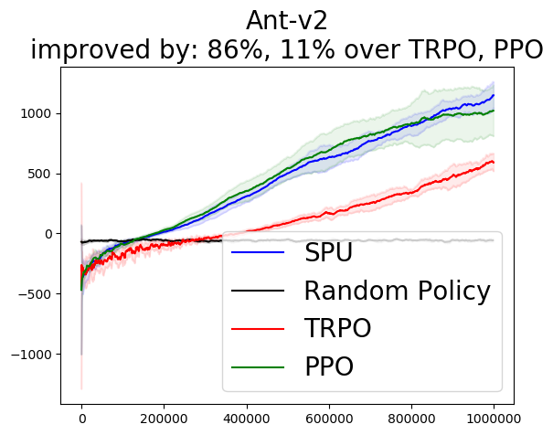
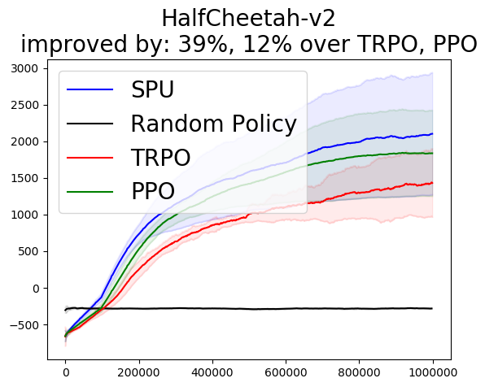
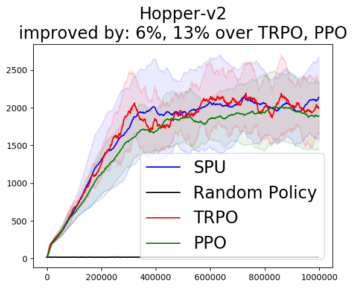
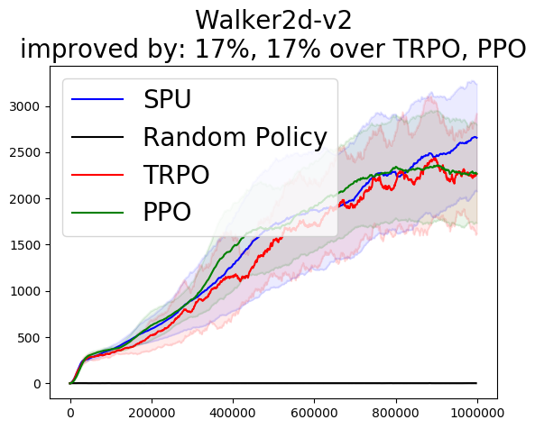
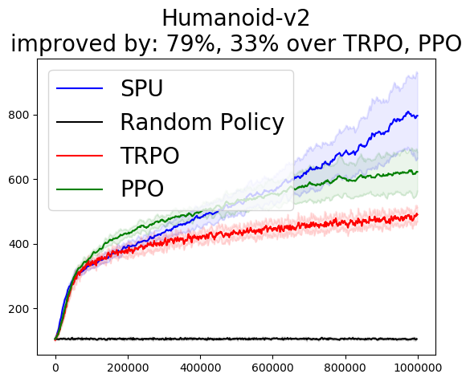
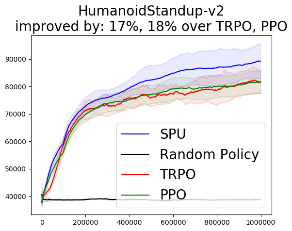
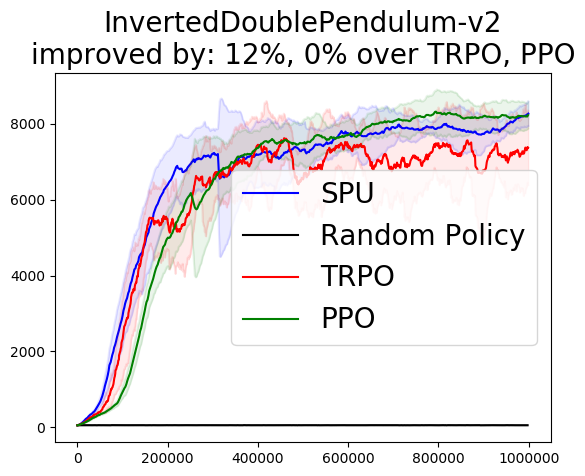
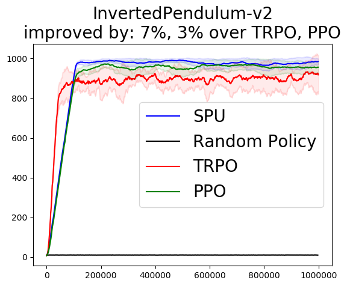
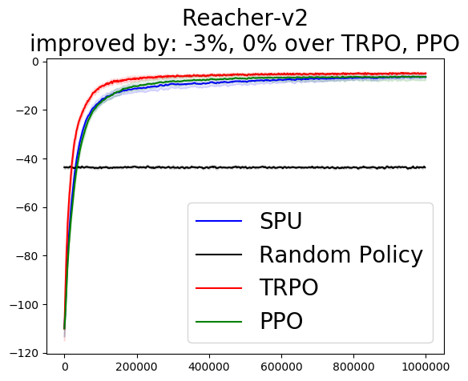
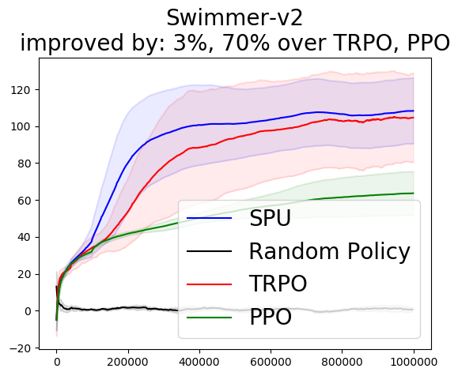

This repository contains a minimal example to reproduce Mujoco results in the paper `Supervised Policy Update` (SPU):

[PDF](https://arxiv.org/abs/1805.11706) [Slide](https://drive.google.com/file/d/1Yg8x4bSzoj1t6Sk-_N3jTx2eTaVZGoqW/view?usp=sharing) [Poster](https://drive.google.com/open?id=1lJeP_3YNlUoMaU-RDENDrkfjPdZQYpA3)

# Performance

Measured in terms of final performance and averaged over 10 Mujoco environments with 10 different seeds in each, SPU is 27% and 17% better than TRPO and PPO respectively. Averaged over 60 Atari games with 20 different seeds in each, SPU is 55% better than PPO.







# Dependencies

Main dependencies:

1. Python 3.5
2. Tensorflow
3. Mujoco 1.50

For the remaining dependencies, please inspect and install using `environment.yml` (Anaconda format) and `requirements.txt` (pip format). Most of the code was taken from OpenAI baseline repository. Thus, if you can run OpenAI baselines, then you should have installed the necessary packages to run experiments from this repository. You can also follow the more detailed installation instruction in OpenAI baseline repo.

# Run Experiments

To run SPU on HalfCheetah-v2 using seed 0, do:

```
python run_mujoco.py --env HalfCheetah-v2 --seed 0 
```

# Acknowledgements

Huge thanks to OpenAI for open-sourcing their baselines code.
